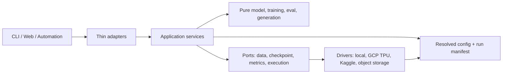

# Flaxchat system audit — 2026-09-03

## Executive assessment

Flaxchat has a credible correctness foundation: the local suite, GitHub CPU
workflow, and a bundled Kaggle TPU v5e-8 acceptance run all pass at commit
`97ba1333bf46b51f85ca3d9099c8c2717438ce91`. The remaining risk is primarily
at the boundaries around the core model: remote training adapters, untrusted
code execution, release/package truthfulness, physical multi-host operation,
published benchmark provenance, and maintainability of script-level
orchestration.

There is no known open model-correctness regression after issue #8. However,
`scripts/train_kaggle.py` is a placeholder that does not train, and the public
"sandbox" wording overstates the security boundary of generated Python
execution. Those are the highest-priority truth and safety gaps.

## Evidence reviewed

- Source and tests at commit `97ba1333bf46b51f85ca3d9099c8c2717438ce91`.
- Local suite: 270 passed, 5 skipped.
- Local non-accelerator coverage suite: 270 passed, 1 skipped, 4 deselected;
  73.51% branch coverage against a 65% floor.
- GitHub CPU workflow: successful on the audited commit.
- Kaggle TPU kernel version 6: 273 passed, 2 skipped; pretrain smoke,
  TinyStories tokenizer through inference, attention, speculative decoding,
  checkpointing, and 1/2/4/8-device scaling all passed.
- Release v0.1.0 artifacts and workflow provenance.
- Configuration, checkpoint, data, evaluation, inference, execution,
  platform-adapter, benchmark, documentation, and workflow code.
- Existing GitHub backlog: issue #1 was the only open issue before this audit.

## Quality assessment (FURPS+)

| Area | Current state | Principal gap |
|---|---|---|
| Functionality | Core training/eval/inference paths pass CPU and TPU acceptance | Legacy Kaggle training command is nonfunctional placeholder code |
| Usability | Reproducibility and operator docs exist | Multiple overlapping remote workflows and stale public claims confuse the supported path |
| Reliability | Checkpoint integrity, resume, topology, numerical safety, and e2e tests are strong | No physical multi-host acceptance; Kaggle monitor exits on transient API outages |
| Performance | Attention, speculative, and single-host scaling emit structured metrics | Tiny scaling case is overhead-dominated; matched framework results are pending |
| Supportability | Validated config, manifests, CI, release gates, and 73.51% coverage | Large import-time scripts and separate platform training forks remain expensive to change |
| Security | Least-privilege workflows, dependency audit, release attestations | Generated Python uses a denylist reliability guard, not a security sandbox |
| Compatibility | macOS/Linux CPU and TPU acceptance pass; v0.1.0 is published | Python metadata disagrees with Pixi/dependency reality; latest TPU fix is unreleased |

## Findings and backlog

Priority follows impact × likelihood. Effort is an estimate range, not a
delivery commitment: S = 0.5–2 engineer-days, M = 2–5 days, L = 1–2 weeks.

| ID | Priority | Effort | Finding and proposal | Issue |
|---|---:|---:|---|---|
| A01 | P0 | M | Replace the kgz/Jupyter placeholder with real exact-revision Kaggle CLI training | [#13](https://github.com/mlnomadpy/flaxchat/issues/13) |
| A02 | P1 | S | Ship the verified TPU initialization fix in v0.1.1 | [#11](https://github.com/mlnomadpy/flaxchat/issues/11) |
| A03 | P1 | L | Extract reusable pretrain/SFT/RL/eval services and make CLIs side-effect-free | [#9](https://github.com/mlnomadpy/flaxchat/issues/9) |
| A04 | P1 | M–L | Put local, GCP, and Kaggle provisioning behind one structured launch contract | [#10](https://github.com/mlnomadpy/flaxchat/issues/10) |
| A05 | P1 | M | Prove initialization, data order, collectives, recovery, and checkpoint portability on physical multi-host TPU | [#12](https://github.com/mlnomadpy/flaxchat/issues/12) |
| A06 | P1 | L | Execute the pinned flaxchat/nanochat/MaxText comparison instead of publishing unmatched feature tables | [#23](https://github.com/mlnomadpy/flaxchat/issues/23) |
| A07 | P1 | M | Make README/docs claims derive from or link to immutable machine-readable records | [#24](https://github.com/mlnomadpy/flaxchat/issues/24) |
| A08 | P1 | L | Replace misleading sandbox claims and isolate untrusted generated code at an OS/container boundary | [#17](https://github.com/mlnomadpy/flaxchat/issues/17) |
| A09 | P1 | M | Build an application-factory web service with manifest validation, cancellation, backpressure, and structured errors | [#14](https://github.com/mlnomadpy/flaxchat/issues/14) |
| A10 | P1 | S–M | Align Python support, wheel metadata, Pixi, Kaggle extras, and accelerator dependency constraints | [#16](https://github.com/mlnomadpy/flaxchat/issues/16) |
| A11 | P1 | S | Deploy Pages from the actual `master` branch and validate docs in pull requests | [#22](https://github.com/mlnomadpy/flaxchat/issues/22) |
| A12 | P2 | S–M | Make Kaggle polling reconnectable and resilient to transient TLS/API failures | [#15](https://github.com/mlnomadpy/flaxchat/issues/15) |
| A13 | P2 | M | Expand Pyright/Ruff and add risk-based module coverage instead of relying only on a global floor | [#20](https://github.com/mlnomadpy/flaxchat/issues/20) |
| A14 | P2 | M | Add representative repeated strong- and weak-scaling experiments while retaining the tiny overhead case | [#21](https://github.com/mlnomadpy/flaxchat/issues/21) |
| A15 | P2 | M | Publish a manifest-bound small checkpoint and deterministic inference demonstration | [#19](https://github.com/mlnomadpy/flaxchat/issues/19) |
| A16 | P2 | M | Pin workflow actions, automate reviewed updates, and attach an SBOM to releases | [#18](https://github.com/mlnomadpy/flaxchat/issues/18) |

## Concrete evidence behind the findings

### Remote execution and packaging

- `scripts/train_kaggle.py` prints that training "would" run and never invokes
  a training stage.
- The supported acceptance runner uses the Kaggle CLI, but the `kaggle`
  optional extra installs `kgz`.
- `scripts/train_tpu.py` builds training as an interpolated command string and
  defines `--preemptible` with `store_true` plus a true default, so there is no
  inverse on-demand selection.
- `requires-python = ">=3.11"` claims Python 3.14 compatibility while Pixi caps
  Python below 3.14 and the required rustbpe package is unavailable in the
  observed Python 3.14 environment.

### Trust boundaries and serving

- `reliability_guard()` explicitly says it is not a security sandbox, while
  README user-facing text calls execution sandboxed.
- The guard mutates a denylist inside a spawned interpreter; it does not define
  a complete filesystem, network, syscall, process, native-code, secret, or
  output-volume boundary.
- `scripts/chat_web.py` loads the model and parses arguments at import time,
  performs synchronous generation inside an async WebSocket handler, and does
  not propagate disconnect cancellation into generation.
- `load_chat_service()` derives architecture from a model tag rather than
  requiring the checkpoint manifest and tokenizer identity.

### Reproducibility and performance

- `benchmarks/baselines/*.yaml` are correctly labeled `pending_matched_run`;
  the matched external framework experiment has not happened.
- `docs/RESULTS.md` points to an older successful TPU revision, not the latest
  acceptance run. README claims that a pipeline completed while the GRPO row
  in the same table says `running`.
- The current fixed-work scaling benchmark uses 589,902 parameters and shows
  expected overhead domination: approximately 2.03M tokens/sec on one device
  versus 1.56M on eight. It is a valid regression case, not a representative
  scaling claim.
- Kaggle validates eight devices on one host. It cannot prove physical
  multi-process TPU behavior.

### Maintainability and delivery

- Training/platform scripts total more than 1,600 lines; `pretrain.py` alone is
  563 lines and executes argument parsing/training at import time.
- The configuration model is useful, but multiple scripts still maintain
  separate flags, model construction, optimizer choices, and artifact flows.
- Current coverage is above its gate, but execution (43%), SFT (55%), tokenizer
  (59%), evaluation (62%), common/runtime (66%), and engine (67%) deserve
  risk-targeted tests.
- Pyright covers only config and pipeline by configuration, and Ruff currently
  selects fatal correctness rules only.
- Pages listens for `main`; the repository default branch is `master`.
- Kaggle version 6 completed successfully, but transient TLS resets terminated
  the local wait loop and required manual status/download retries.

## Target architecture

The refactor should enforce these boundaries:

1. **Core computation** owns pure/jitted model, optimizer, train, eval, and
   generation functions. It has no CLI, provisioning, or network behavior.
2. **Application services** own stage sequencing, validated configuration,
   deterministic seeds, lifecycle, checkpoint/resume, and structured results.
3. **Ports** define narrow protocols for data, checkpoints, metrics, generated
   code execution, and artifact publishing.
4. **Drivers/adapters** translate CLI/web/cloud inputs into requests and render
   results. They never implement a training loop.
5. **Run identity** is one immutable resolved config + source/data/tokenizer/
   environment manifest shared by local, GCP, Kaggle, and release evidence.

## Delivery sequence and dependencies

### Phase 0 — make public contracts truthful

1. #13 replace the fake Kaggle trainer.
2. #17 correct and isolate the generated-code trust boundary.
3. #16 align supported package/dependency metadata.
4. #22 repair documentation deployment.
5. #11 cut v0.1.1 with the already verified TPU fix.

### Phase 1 — remove architectural forks

1. #9 extracts stage services and side-effect-free CLIs.
2. #10 consumes those services from all platform adapters.
3. #14 builds serving on a manifest-validated inference service.
4. #20 raises verification depth around the changed boundaries.

### Phase 2 — prove scale and publish evidence

1. #12 validates physical multi-host behavior.
2. #15 makes the accelerator monitor durable.
3. #21 produces representative scaling data.
4. #23 runs the matched framework comparison.
5. #24 publishes one evidence-backed results index.
6. #19 publishes the small checkpoint/demo after serving and release contracts
   are stable.
7. #18 completes supply-chain hardening.

The critical architectural path is **#9 → #10 → #12/#23**. The patch release
#11 should not wait for that refactor; it packages an already verified fix.

## Definition of done for the audit backlog

- Every issue closes against its binary acceptance criteria and links tests or
  immutable run evidence.
- Public claims distinguish unit, synthetic multi-device, single-host TPU, and
  physical multi-host evidence.
- Supported commands perform the operation they advertise from a clean
  checkout; placeholders are examples, not executable product entry points.
- No release claims compatibility outside the tested Python/JAX/accelerator
  matrix.
- No generated code is called sandboxed unless an explicit, reviewed threat
  model and isolation boundary justify the term.

