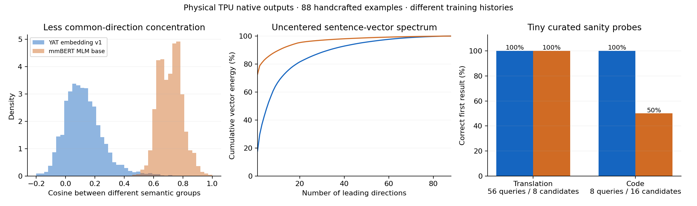

# YAT versus mmBERT: native sentence-vector analysis

The released YAT embedding v1 produces substantially less concentrated sentence vectors than the mmBERT MLM base checkpoint on this diagnostic fixture. Native forward outputs are finite and repeatable. The attempted layer instrumentation failed its numerical agreement gate, so attention entropy, residual/FFN contributions and adaptive-distance repair frequency remain **unvalidated**. These failures concern the diagnostic trace; they do not establish a failure of the released native encoder.

## What ran

Two bounded Spot v5e-8 allocations in `azettaai`, `us-west4-a`, ran the pinned JAX harness. One TPU device executed each model, sequentially. There were no CPU model forwards or backwards. CPU NumPy only summarized vectors already produced on TPU; the baseline's PyTorch file was converted using the existing tensor-only loader.

Both models used batch 8, padded sequence length 128, native mean pooling, BF16 features and FP32 residuals. Tokenizer bytes and all tokenized input bytes matched. No example was truncated: input lengths were 6–119 tokens. Fixed YAT bias 1, epsilon 0.01 and learned alpha values were preserved.

| Model | Immutable Hugging Face revision | Original weight SHA256 |
| --- | --- | --- |
| `mlnomad/yat-mmbert-base-embedding-v1` | `571d0ef3d8e1381055845fce334a48be253c3fea` | `6ee56349adbf10a3c3d5805d94539f987250aea2c98611b4d89c6fd9b7142aff` |
| `jhu-clsp/mmBERT-base` | `c5955035435e2bf121cde7f3c8863ef52ff35d82` | `8ea64ec1ea4eb8fca0fc14b69a2ae571de6bfbc25fd214bb932dd4aba6a3a04e` |

The fixture contains 88 handcrafted examples: eight English concepts with translations into Spanish, French, German, Arabic, Chinese, Japanese and Hindi; eight English code queries; and corresponding Python and JavaScript functions. Its independently retained SHA256 is `a63db9a4496e27bd23355c58234b86967cb0f88b4bf725204cedcc148fd1357d`. These are simple diagnostic examples, not official evaluation data or a representative production corpus.

YAT has contrastive fine-tuning; the mmBERT checkpoint is an MLM base. This comparison controls execution and input, but does **not** isolate architectural effects or compare against a similarly fine-tuned mmBERT embedding model.

## Verified native results

All 88 native vectors from both models were authenticated, finite and nonzero. Geometry uses individually L2-normalized vectors. Effective rank here is **energy-entropy rank**: `exp(-sum(p * log(p)))`, where `p` is normalized squared singular-value energy. Centered rank cannot exceed 87 for 88 examples.

| Diagnostic | YAT embedding v1 | mmBERT MLM base |
| --- | ---: | ---: |
| Mean distinct-pair cosine | 0.1573 | 0.7224 |
| Uncentered leading-direction energy | 17.85% | 72.71% |
| Uncentered energy-entropy rank, maximum 88 | 28.05 | 4.41 |
| Centered energy-entropy rank, maximum 87 | 32.52 | 26.70 |
| Centered leading-direction energy | 14.68% | 22.68% |
| Same semantic-group mean cosine | 0.6273 | 0.8406 |
| Different semantic-group mean cosine | 0.1248 | 0.7142 |
| Same-minus-different group cosine margin | 0.5025 | 0.1264 |

The main difference is common-direction concentration, rather than a complete absence of semantic variation in mmBERT. Its centered rank remains 26.7. The intentionally repeated semantic concepts influence all aggregate statistics. A larger rank or smaller mean cosine alone is not proof of better retrieval.

| Input domain | Examples | YAT mean pair cosine | mmBERT mean pair cosine | YAT centered rank | mmBERT centered rank |
| --- | ---: | ---: | ---: | ---: | ---: |
| English sentences | 8 | 0.1209 | 0.7961 | 6.88 | 6.74 |
| Translated sentences | 56 | 0.2272 | 0.7774 | 25.63 | 24.66 |
| English code queries | 8 | 0.3388 | 0.8377 | 6.33 | 5.94 |
| Python/JavaScript code | 16 | 0.4767 | 0.8668 | 8.67 | 6.98 |

Two small cosine-retrieval probes provide context:

| Curated probe | Queries / candidates | YAT R@1 / MRR | mmBERT R@1 / MRR |
| --- | --- | ---: | ---: |
| Translation → English concept | 56 / 8 | 100% / 1.000 | 100% / 1.000 |
| English query → Python or JavaScript function | 8 / 16 | 100% / 1.000 | 50% / 0.633 |

Every translation language scored 8/8 for both models; the translation probe is too easy to discriminate them. Either programming-language implementation is a correct code result. Eight code queries are insufficient for a product or leaderboard claim. Candidate order is fixed and ties use stable sorting.

YAT's entire `[88, 768]` native output array was **bit-identical across the two independent TPU allocations**. Regrouping the first eight diagnostic examples also produced exactly identical native vectors for both models. These are narrow inference repeatability observations, not training/recovery qualification.

## Instrumentation failure and harness changes

The original worker executed separately compiled layers and compared them with native full-model pooling. Its first YAT trace failed the predeclared absolute/relative bounds of **0.01 / 0.005**. The corrected worker uses one full-forward JIT, the native rematerialization policy, and a fresh native forward on the exact diagnostic batch. It retains raw trace/reference arrays and separately measures batch-regrouping drift. The original failure remains preserved.

| Attempt / model | Maximum absolute drift | Relative L2 drift | Accepted |
| --- | ---: | ---: | --- |
| Original layer trace / YAT | 0.07602 | 0.008109 | No |
| Full-forward trace / YAT | 0.08748 | 0.009224 | No |
| Full-forward trace / mmBERT | 0.05204 | 0.004105 | No; absolute bound failed |

Instrumentation changes the compiled graph; BF16 compilation/fusion differences are a plausible explanation, but the precise cause has **not** been isolated. A source-level review found no blocking block-operation mismatch; that review does not override the physical failures. The second implementation did not solve the agreement problem. No bound was relaxed.

Consequently, neither attempt qualifies mechanistic conclusions about late FFN prototype alignment, dead or dominant attention heads, attention entropy, FFN update strength, sparsity or adaptive repair frequency. Those raw fields remain in failed receipts for debugging and are explicitly excluded from the verified findings. No latency is inferred from the instrumented run.

New tools:

- `scripts/analyze_encoder_activations_tpu.py`: bounded actual-weight TPU execution, incremental native-vector retention, traced/native checks and raw comparison arrays.
- `scripts/report_encoder_activations.py`: scalar-only artifact verifier; validates original weight/revision, fixture, tokenizer/input, runtime/hardware, independently frozen source-map and NPZ identities. Full reporting replays the original drift bounds from raw arrays. `--native-only` preserves trace failures and emits no interpreted layer metrics.

The paired native report passed this verifier. Source/manifest admission and syntax checks also passed. Full layer-trace acceptance failed on physical TPU; no skip or metadata check is presented as a pass.

## Decision and remaining work

Preserve the trained checkpoint and alphas. These results support continuing representation training rather than changing or regularizing the architecture based on static weight alignment. Compare future checkpoints against this parent on independently prepared, harder multilingual retrieval and code data, including hard negatives and per-language regression checks. A similarly contrastively fine-tuned mmBERT baseline is needed for a meaningful architecture comparison.

The next instrumentation gate is to isolate which captured intermediate/reduction first changes the native computation and demonstrate trace/native agreement within the original bounds before measuring layer contributions or repair frequency. It needs a changed, reviewable diagnostic design; repeating these two failed approaches is not warranted. A short native JAX/XProf trace remains the appropriate separate tool for attributing the previously measured speed gap.

## Accounting and cleanup

Each attempt reserved $11.60: a 30-minute workload lease, a separate 30-minute cleanup allowance at the conservative whole-slice $9.60/hour on-demand ceiling, and $2 ancillary allowance. **$23.20 is a reservation total, not posted spend.** Actual Spot charges for these runs have not been isolated. The observed available promotional balance before launch was $879.75; provider posting can lag.

The supervisor completed cleanup after each failed trace campaign. Separate provider describe calls independently returned `NOT_FOUND` for both exact queues and nodes. No analysis TPU remains. This is scoped cleanup evidence, not an all-cloud or empty-storage assertion; model weights and reports were retained.

Replayable fixture, model receipts, pooled/trace arrays, independent source maps, native summary, deployment results and cleanup observations are in `artifacts/yat-activation-analysis-20261004/attempt-01/` and `attempt-02/`. The attempt-02 verified native summary SHA256 is `5de5043d513b9a93267a49f142764f6600eec257ead44af4a42eee10dc737b85`.

Original operational receipts remain in the local audit bundle and are excluded from Git. Public figures and the [native-vector summary](assets/yat-native-embedding-summary.json) contain only model diagnostics.
