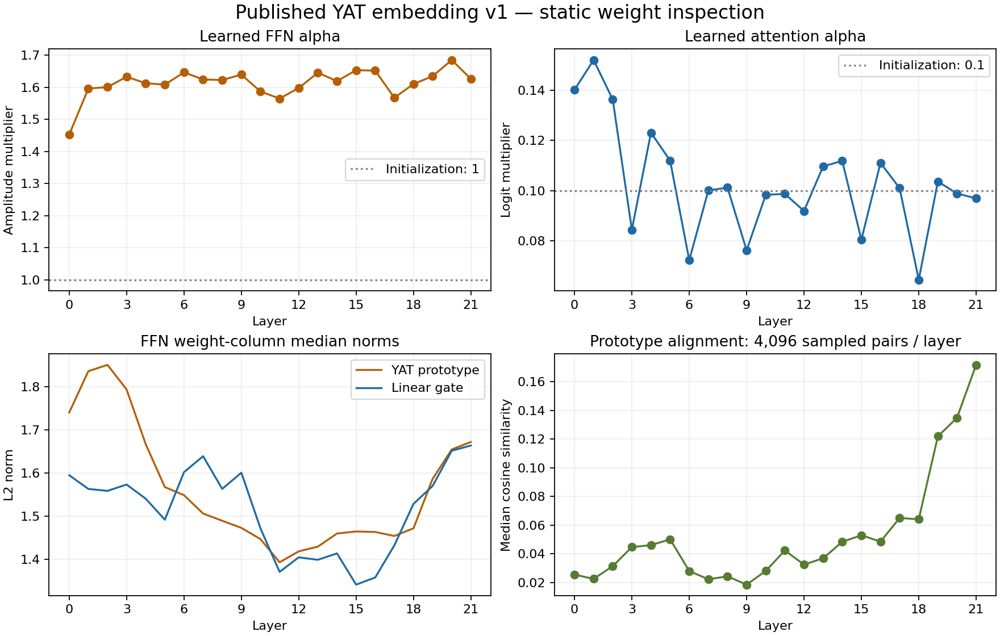

# Published YAT embedding v1: static weight analysis

The stored weights show no numerical corruption or zero-weight collapse. All trainable YAT alpha values remain positive. The strongest structural pattern to investigate is increased alignment among FFN prototypes in the final three layers. Static weights alone cannot decide whether this reflects useful specialization or redundant representation capacity.

The analysis authenticates the complete 1,231,164,480-byte public Safetensors file against SHA256 `6ee56349adbf10a3c3d5805d94539f987250aea2c98611b4d89c6fd9b7142aff`, from `mlnomad/yat-mmbert-base-embedding-v1` at revision `571d0ef3d8e1381055845fce334a48be253c3fea`. These are the same weights used in the lightweight TPU speed comparison. All tensors were inspected; no model was initialized or executed. Static statistics ran in a free, bounded Cloud Shell job with Python 3.12.3 and NumPy 2.4.6. No paid accelerator or VM was allocated. Only small reports were downloaded locally.

| Check | Measured result |
|---|---:|
| Stored parameter elements, including scalar alphas | 307,786,284 |
| Tensors | 181 |
| NaN or infinity values | 0 |
| Exactly zero parameter values | 0 |
| Zero token embedding rows | 0 / 256,000 |
| Zero FFN prototype columns | 0 / 25,344 |
| Zero or negative YAT alphas | 0 / 44 |
| Stored tensor dtype | FP32 |

FP32 storage does not mean FP32 feature computation: the released encoder uses BF16 feature arithmetic with its existing FP32 residual and score policy. Neither storage dtype nor the absence of bad values establishes model quality.

## Learned YAT scales

Each of the 22 layers has an FFN alpha and an attention alpha. FFN alpha multiplies the YAT feature amplitude; attention alpha multiplies attention logits. Neither is an exponent. They are raw trainable scalars, without positivity enforced by the forward function.

| Parameter | Minimum | Mean | Maximum | Original initialization |
|---|---:|---:|---:|---:|
| FFN alpha | 1.4525 | 1.6128 | 1.6852 | 1.0 |
| Attention alpha | 0.06443 | 0.10291 | 0.15205 | 0.1 |

The network learned stronger FFN scaling and different attention scaling across layers. Higher positive attention alpha sharpens a fixed set of logits, but comparisons of actual attention sharpness require token activations because query/key distributions also change. Fixed kernel bias 1 and epsilon 0.01 remain the released architecture choices.

Compared with the authenticated retained contrastive step-12,000 checkpoint, the largest relative FFN alpha change is +3.43% at layer 0; the largest attention alpha change is +6.52% at layer 5. Those changes prove movement in these parameters during the later stage; they do not quantify overall weight movement or quality improvement. All prior checkpoint SHA identities are retained alongside the scalar comparison.

## FFN prototypes and attention projections

Flax `wi` has shape `[768, 2304]`: its first 1,152 columns are YAT prototypes, and its remaining columns form the linear gate. Layer median prototype norms range from 1.39 to 1.85; gate medians range from 1.34 to 1.66. Every prototype column has nonzero norm.

For each layer, 4,096 distinct-index prototype pairs were sampled using a fixed seed. Median cosine similarity is about 0.02–0.065 through layers 0–18, then rises to 0.122, 0.135 and 0.172 at layers 19–21. That is a measurable increase in shared directions, not proof of duplicate prototypes or complete FFN collapse. Sampling does not inspect every possible pair.

All Q/K/V projection norms were measured separately for all 12 heads per layer. The largest within-projection head norm ratio is 2.44× in layer 1's V projection. This is a candidate for an activation inspection, not evidence that a head is dead or dominates attention. Actual YAT attention compares input-dependent, projected and RoPE-transformed queries and keys, not static columns of the Q/K/V weights.

LayerNorm gains vary by channel; two embedding-norm gains and one layer-19 FFN norm gain are negative. Learned negative gains are allowed and are not numerical corruption. LayerNorm does not guarantee unit vector norm, particularly with learned gains; replacing the input squared norm by 1 would remain incorrect.

## Token embeddings

The vocabulary table is `[256000, 768]`, accounting for 196,608,000 parameters, or 63.88% of stored parameter elements. Token-vector norm median is 1.413; the central 98% lies between 1.176 and 1.728. The largest row norm is 1.994, so there is no massive row-norm outlier in the table.

A fixed uniform sample of 512 vocabulary vectors, normalized individually, has mean distinct-pair cosine 0.0285. Its uncentered effective rank is 335.8, and the largest direction explains 3.67% of sampled energy. This sample retains broad directional diversity. Rank is bounded by the sample size; these are token-weight statistics, not sentence-embedding effective rank, multilingual balance, or retrieval quality.

## Deployment and next measurements

The largest absolute scale outlier, 16.12, is in `head_norm`, and decoder bias reaches magnitude 15.54. Those are MLM-head tensors, not part of the `encode` → `pool` embedding path. The retained `head_dense`, `head_norm` and decoder bias contain 846,592 parameters, about 3.39 MB in FP32. A future serving-only export could omit them while preserving the training checkpoint. This would slightly reduce download/storage, not accelerate an embedding forward that already excludes the head.

Before changing architecture or regularizing the final FFNs, measure pooled sentence embedding anisotropy/effective rank across English, multilingual and code inputs; per-layer residual/FFN contributions; per-head attention entropy; and the adaptive-distance repair frequency on physical TPU. Static weights cannot explain the measured latency gap or establish that a proposed change improves quality. Preserve trained alphas and the fixed kernel constants until those measurements support a change.

Raw statistics, per-layer/per-head values, source SHA, prior-stage alpha comparisons and authentication/cleanup receipts are in `artifacts/yat-weight-analysis-20261004/`. The job returned zero, its independent controller verified process and scratch cleanup, and a separate observation confirmed no remaining owned processes or work directory. Source and evidence files were retained.

The follow-up [physical TPU sentence-vector analysis](YAT_ACTIVATION_ANALYSIS_2026-10-04.md) measured native pooled geometry and small multilingual/code probes against mmBERT. YAT native outputs were repeatable and less concentrated on this fixture. Layer instrumentation failed its original agreement bounds, so it did not qualify attention/FFN contribution or adaptive-repair conclusions.

Original operational receipts remain in the local audit bundle and are excluded from Git. Public figures and the [native-vector summary](assets/yat-native-embedding-summary.json) contain only model diagnostics.
