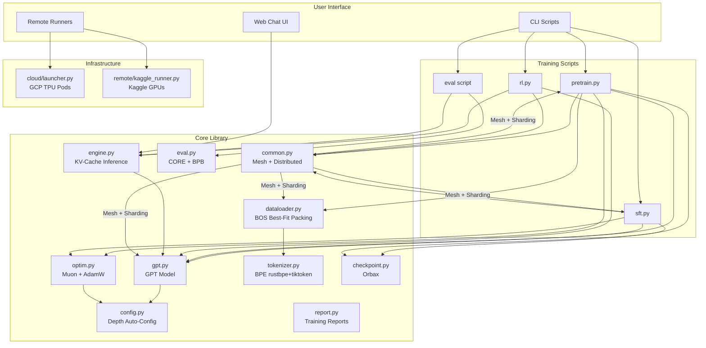
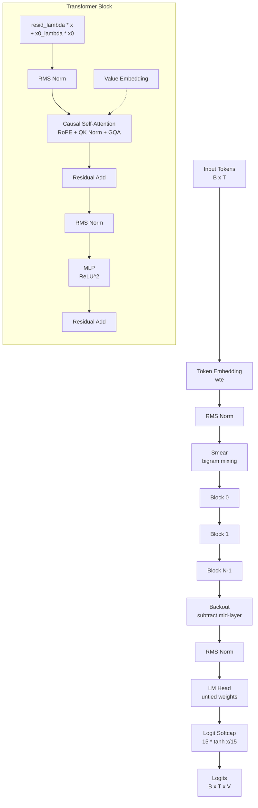
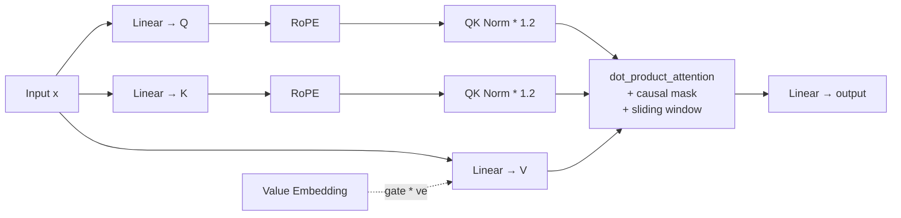
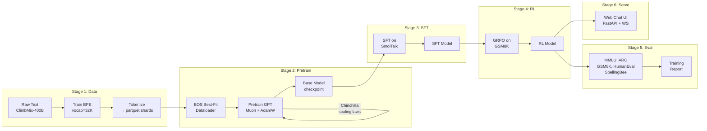
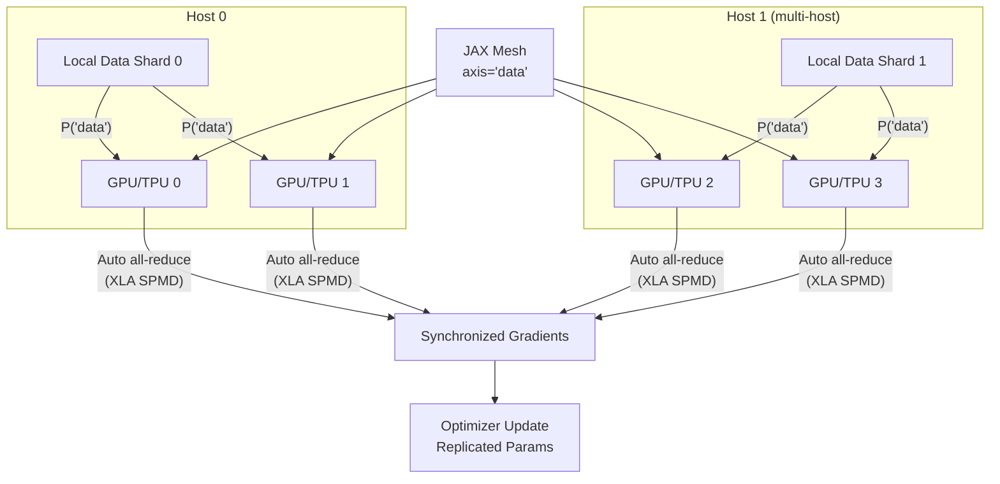

# Architecture

## System Overview

flaxchat is a complete LLM training pipeline that runs on TPU pods and GPUs with automatic data parallelism.



## Module Dependency Graph

```
flaxchat/__init__.py
    ├── config.py          (no internal deps)
    ├── common.py          (no internal deps)
    ├── gpt.py             ← config.py, common.py
    ├── optim.py           ← config.py (via setup_optimizer)
    ├── tokenizer.py       (no internal deps)
    ├── dataloader.py      ← dataset.py, common.py
    ├── dataset.py         ← common.py
    ├── engine.py          ← gpt.py, common.py
    ├── eval.py            ← common.py
    ├── checkpoint.py      (no internal deps, uses orbax)
    ├── report.py          ← common.py
    ├── remote/
    │   ├── base.py        (no deps — abstract interface)
    │   └── kaggle_runner.py ← base.py
    └── cloud/
        ├── tpu_vm.py      (no internal deps — uses gcloud CLI)
        └── launcher.py    ← tpu_vm.py, remote/base.py
```

No circular dependencies. `config.py` and `common.py` are leaf modules.

## GPT Model Architecture



### Attention Detail



## Training Pipeline



## Data Parallelism



### Sharding Strategy

| Component | Sharding | Mesh Axis |
|-----------|----------|-----------|
| Input data (batch dim) | `P('data')` | Split across devices |
| Model params | `P()` | Replicated on all devices |
| Gradients | Auto all-reduce | XLA handles it |
| Optimizer state | `P()` or `P('fsdp')` | Replicated or sharded |

For models too large for one device, use `shard_model_fsdp()` which shards
the first dimension of 2D+ params across the `fsdp` mesh axis.
