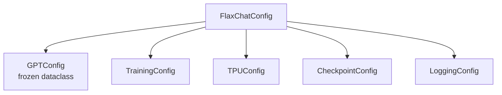

# Configuration

## Config Hierarchy



## Quick Start

```python
import flaxchat

# From a single depth dial (auto-computes everything)
config = flaxchat.FlaxChatConfig.from_depth(depth=24)

# From YAML
config = flaxchat.FlaxChatConfig.from_yaml("configs/d24.yaml")

# From dict
config = flaxchat.FlaxChatConfig.from_dict({
    "model": {"n_layer": 12, "n_embd": 768},
    "training": {"device_batch_size": 16},
})
```

## GPTConfig (Model Architecture)

```python
@dataclass(frozen=True)
class GPTConfig:
    sequence_len: int = 2048     # Max context length
    vocab_size: int = 32768      # BPE vocabulary
    n_layer: int = 12            # Transformer depth
    n_head: int = 6              # Query heads
    n_kv_head: int = 6           # KV heads (GQA if < n_head)
    n_embd: int = 768            # Model dimension
    window_pattern: str = "SSSL" # Sliding window (S=short, L=long)
```

### Depth Auto-Config

The `from_depth()` constructor derives all dimensions from depth:

| Depth | n_embd | n_head | Params (approx) |
|-------|--------|--------|-----------------|
| 4 | 256 | 2 | ~3M |
| 8 | 512 | 4 | ~19M |
| 12 | 768 | 6 | ~85M |
| 20 | 1280 | 10 | ~350M |
| 24 | 1536 | 12 | ~600M |
| 36 | 2304 | 18 | ~1.6B |

Formula: `n_embd = depth * aspect_ratio` (default 64), rounded up to `head_dim` (128).

## TrainingConfig

```python
@dataclass
class TrainingConfig:
    # Horizon (precedence: num_iterations > target_flops > target_param_data_ratio)
    num_iterations: int = -1
    target_param_data_ratio: float = 12.0   # Chinchilla-style

    # Batch
    device_batch_size: int = 32
    total_batch_size: int = -1              # -1 = auto from scaling laws

    # Learning rates (base, scaled by batch size)
    embedding_lr: float = 0.3
    unembedding_lr: float = 0.008
    matrix_lr: float = 0.02                 # Muon
    scalar_lr: float = 0.5
    weight_decay: float = 0.28              # Cosine decay to 0

    # Schedule
    warmup_steps: int = 40
    warmdown_ratio: float = 0.65
    final_lr_frac: float = 0.05
```

### Scaling Laws

flaxchat uses Chinchilla scaling to auto-compute optimal training:

1. **Token horizon**: `tokens = target_param_data_ratio * scaling_params`
2. **Batch size**: `B_opt ∝ D^0.383` (Power Lines paper)
3. **LR scaling**: `η ∝ √(B/B_ref)`
4. **Weight decay**: `λ = λ_ref · √(B/B_ref) · (D_ref/D)` (T_epoch framework)

## TPUConfig

```python
@dataclass
class TPUConfig:
    precision: str = "bf16"      # bf16 | f32
    data_parallel: int = -1      # -1 = all devices
    fsdp: int = 1                # FSDP sharding factor
    tensor_parallel: int = 1     # Tensor parallel factor
```

Mesh shape: `(data_parallel, fsdp, tensor_parallel)` = total devices.

## YAML Example

```yaml
# configs/d24.yaml
model:
  sequence_len: 2048
  vocab_size: 32768
  n_layer: 24
  n_head: 12
  n_kv_head: 12
  n_embd: 1536
  window_pattern: "SSSL"

training:
  target_param_data_ratio: 12
  device_batch_size: 32
  warmup_steps: 40

tpu:
  precision: "bf16"

checkpoint:
  max_to_keep: 3

logging:
  run_name: "d24-pretrain"
  wandb_project: "flaxchat"
```
