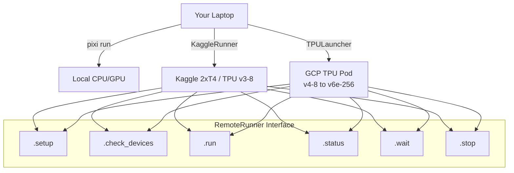
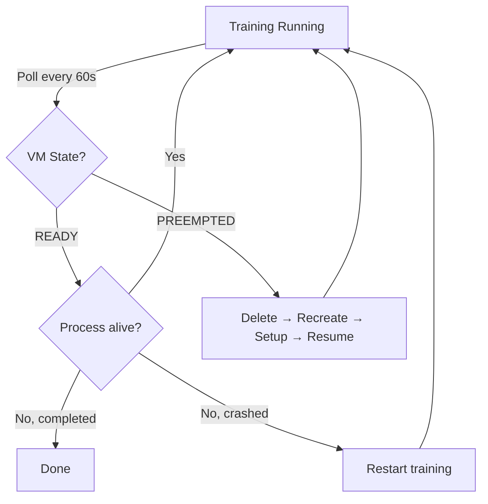

# Deployment Guide

## Remote Execution Backends

flaxchat supports three ways to run training:



All backends implement the same `RemoteRunner` interface.

## 1. Local (laptop/workstation)

```bash
pixi install
python -m scripts.run_tinystories --depth=4 --steps=1000
```

## 2. Kaggle (free GPUs)

```python
from flaxchat.remote import KaggleRunner

# Paste your Kaggle notebook URL
runner = KaggleRunner("https://kkb-production.jupyter-proxy.kaggle.net/k/.../proxy")
runner.setup()
runner.check_devices()  # {'backend': 'gpu', 'device_count': 2}
runner.run(code)        # Execute Python code via WebSocket
runner.wait()
```

## 3. GCP TPU Pod

### CLI Workflow

```bash
# 1. Create TPU VM
python -m flaxchat.cloud.launcher \
    --project=my-project --zone=us-central2-b \
    --tpu-name=flaxchat-d24 --accelerator=v4-8 \
    --create --setup --upload=.

# 2. Launch training
python -m flaxchat.cloud.launcher \
    --project=my-project \
    --run "python -m scripts.pretrain --depth=24"

# 3. Monitor
python -m flaxchat.cloud.launcher --project=my-project --logs
python -m flaxchat.cloud.launcher --project=my-project --health

# 4. Auto-recovery from preemption
python -m flaxchat.cloud.launcher --project=my-project \
    --recover "python -m scripts.pretrain --depth=24"

# 5. Teardown
python -m flaxchat.cloud.launcher --project=my-project --teardown
```

### Python API

```python
from flaxchat.cloud import TPULauncher, TPUConfig

config = TPUConfig(
    project="my-project",
    zone="us-central2-b",
    tpu_name="flaxchat-d24",
    accelerator_type="v4-8",
    preemptible=True,
)
launcher = TPULauncher(config)

launcher.create()
launcher.setup(local_repo_path=".")
launcher.run("python -m scripts.pretrain --depth=24")
launcher.logs(follow=True)  # Ctrl-C to detach
launcher.wait()
launcher.download_checkpoint("./checkpoints")
launcher.teardown()
```

### TPU Types

| Accelerator | Chips | Workers | Free Tier | Zones |
|-------------|-------|---------|-----------|-------|
| `v4-8` | 4 | 1 | On-demand | us-central2-b |
| `v4-32` | 16 | 4 | No | us-central2-b |
| `v5litepod-8` | 8 | 1 | TRC | us-central1-a |
| `v5litepod-64` | 64 | 8 | TRC | us-central1-a |
| `v6e-8` | 8 | 1 | TRC | europe-west4-a |
| `v6e-64` | 64 | 8 | No | europe-west4-a |

### Multi-Host Training

For pods with >8 chips, flaxchat automatically:
1. Creates multi-worker VMs via `num_workers_for(accelerator)`
2. SSHs commands to all workers in parallel
3. Distributes config via internal network
4. JAX's `jax.distributed.initialize()` handles cross-host coordination
5. SPMD mesh spans all chips across all hosts

### Preemption Recovery



Relies on Orbax checkpoints for resume — training picks up from last saved step.

## Export

### Checkpoint Formats

| Format | File | Use Case |
|--------|------|----------|
| JAX checkpoint | `model.pkl` | Resume training, load in flaxchat |
| NumPy weights | `weights.npz` | Portable, load anywhere |
| StableHLO | `model.stablehlo` | LiteRT/TFLite conversion input |

### LiteRT/TFLite Conversion

```bash
# On Linux with TensorFlow:
python -m scripts.convert_to_tflite \
    --checkpoint=exports/model.pkl \
    --output=exports/model.tflite
```
