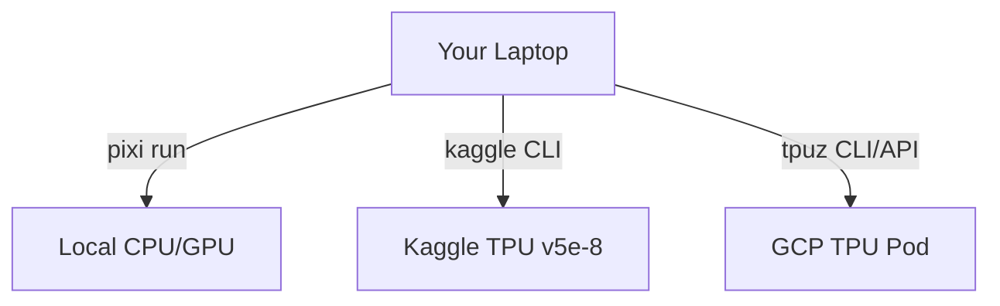
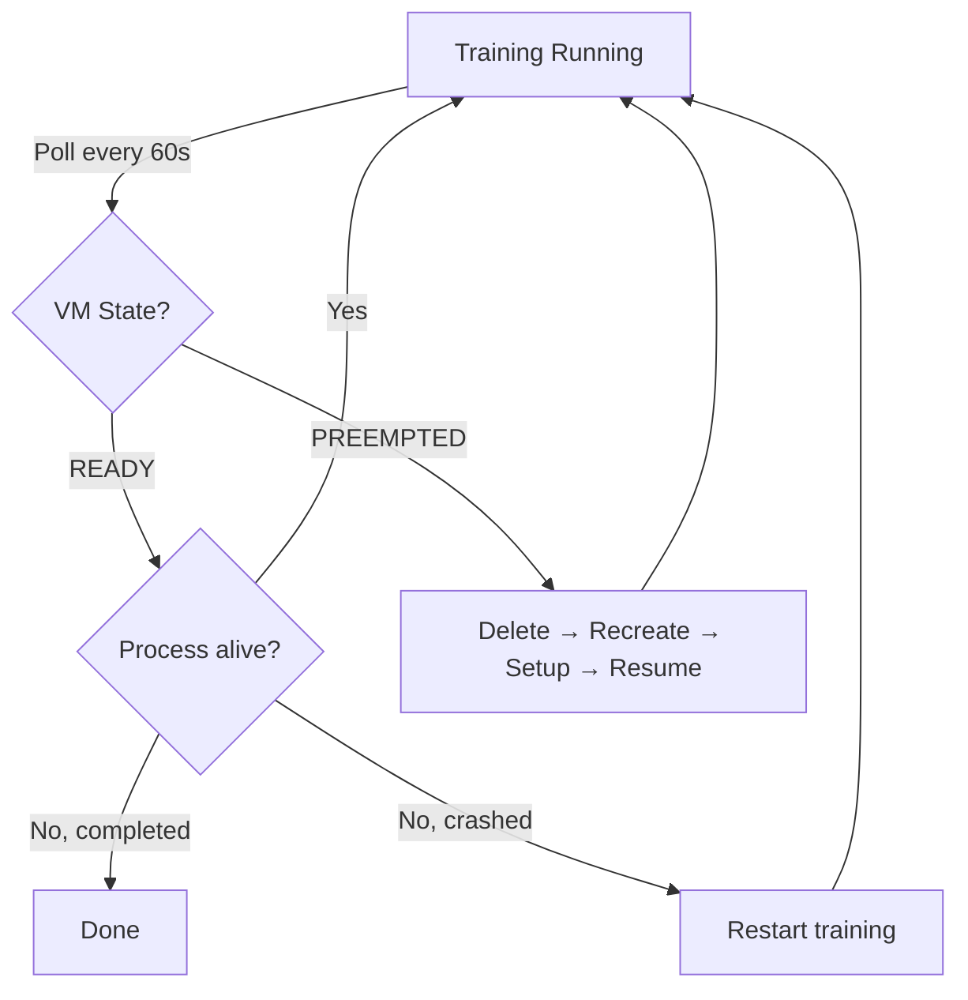

# Deployment Guide

## Remote Execution Backends

flaxchat supports local execution plus two CLI-driven accelerator paths:


```mermaid
graph TD
    USER[Your Laptop] --> |"pixi run"| LOCAL[Local CPU/GPU]
    USER --> |"kaggle CLI"| KAGGLE[Kaggle TPU v5e-8]
    USER --> |"tpuz CLI/API"| GCP[GCP TPU Pod]
```

All backends emit the same serializable `flaxchat.launch.LaunchSpec`; adapters
handle provisioning and transport while training stays in shared services.

## 1. Local (laptop/workstation)

```bash
pixi install
python -m scripts.run_tinystories --layers=4 --pretrain-steps=1000
```

## 2. Kaggle training and accelerator validation

```bash
python -m pip install kaggle
python -m scripts.train_kaggle \
  --kernel-id OWNER/flaxchat-training --accelerator tpu --steps 100 --no-wait

# Resume monitoring later without submitting another paid/quota-consuming run.
python -m scripts.kaggle_tpu_tests \
  --kernel-id OWNER/flaxchat-training --resume-monitor

# Full acceptance bundle (run only for release candidates or accelerator changes).
python -m scripts.kaggle_tpu_tests \
  --kernel-id OWNER/flaxchat-tpu-tests --accelerator tpu --wait
```

Both generated private kernels check out an exact 40-character Git revision.
The acceptance kernel installs
TPU JAX, verifies eight devices, runs the entire suite once, executes the pinned
TinyStories end-to-end pipeline, and records attention/speculative benchmarks.
Logs, artifacts, JUnit XML, and a JSON summary are downloaded together.
Transient Kaggle API outages are persisted locally and retried; `--resume-monitor`
reconnects without creating a duplicate kernel version.

## Web chat service

`scripts.chat_web` is an application factory: importing it does not parse
arguments or load model state. Production adapters should inject a
manifest-verified `ChatService` and set bounded input, generation, concurrency,
and output-buffer limits through `WebSettings`.

The WebSocket protocol emits `token`, `done`, or structured `error` events.
Error codes are `invalid_json`, `invalid_request`, `context_overflow`,
`overloaded`, `request_error`, and `model_error`; internal model exceptions are
not exposed. Disconnects signal cooperative cancellation into cached decoding.

## 3. GCP TPU Pod

The production flex-start launcher, pinned environment, worker coordination,
artifact collection, and teardown guardrails live in [`infra/tpu/`](../infra/tpu/README.md).

### Python API

```python
from tpuz import TPU

tpu = TPU("flaxchat-d24", accelerator="v6e-8")
tpu.up()
tpu.setup(extra_pip="flaxchat")
tpu.run("python -m scripts.pretrain --depth=24", sync=".")
```

### TPU Types

| Accelerator | Chips | Workers | Free Tier | Zones |
|-------------|-------|---------|-----------|-------|
| `v4-8` | 4 | 1 | On-demand | us-central2-b |
| `v4-32` | 16 | 4 | No | us-central2-b |
| `v5litepod-8` | 8 | 1 | TRC | us-central1-a |
| `v5litepod-64` | 64 | 8 | TRC | us-central1-a |
| `v6e-8` | 8 | 1 | TRC | europe-west4-a |
| `v6e-64` | 64 | 8 | No | europe-west4-a |

### Multi-Host Training

For pods with multiple processes, JAX distributed initialization coordinates
hosts and FlaxChat builds one global SPMD mesh. Each host consumes alternating
parquet row groups and reconstructs global batches with
`jax.make_array_from_process_local_data`.

### Preemption Recovery


```mermaid
graph TD
    RUNNING[Training Running] --> |"Poll every 60s"| CHECK{VM State?}
    CHECK --> |READY| ALIVE{Process alive?}
    ALIVE --> |Yes| RUNNING
    ALIVE --> |No, completed| DONE[Done]
    ALIVE --> |No, crashed| RESTART[Restart training]
    CHECK --> |PREEMPTED| RECOVER[Delete → Recreate → Setup → Resume]
    RECOVER --> RUNNING
    RESTART --> RUNNING
```

Relies on Orbax checkpoints for resume — training picks up from last saved step.

## Export

### Checkpoint Formats

| Format | File | Use Case |
|--------|------|----------|
| JAX checkpoint | `model.pkl` | Resume training, load in flaxchat |
| NumPy weights | `weights.npz` | Portable, load anywhere |
| StableHLO | `model.stablehlo` | LiteRT/TFLite conversion input |

### LiteRT/TFLite Conversion

```bash
# On Linux with TensorFlow:
python -m scripts.convert_to_tflite \
    --checkpoint=exports/model.pkl \
    --output=exports/model.tflite
```
