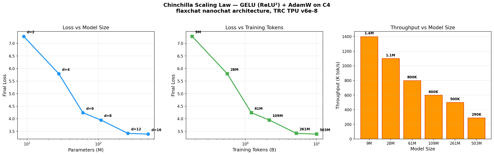

# flaxchat

A minimal, end-to-end LLM training harness for **Google Cloud TPU pods**, built on **JAX/Flax NNX**.

Port of [nanochat](https://github.com/karpathy/nanochat) to the JAX ecosystem with full feature parity plus speculative decoding.

Part of the **2026 Q1 TPU Research Sprint**, supported by the [Google AI Developer Programs](https://developers.google.com/programs) team.

---

## Quick Start

```bash
pixi install
pixi run test          # 148 tests
pixi run -- python -m scripts.run_tinystories --depth=8 --steps=5000
```

---

## Core Features

### GPT Architecture (all nanochat features)
- Rotary Embeddings (RoPE), Group-Query Attention (GQA), QK Normalization
- ReLU^2 MLP, Value Embeddings (ResFormer), Sliding Window (SSSL pattern)
- Per-layer Residual Scaling, Smear, Backout, Logit Soft-capping
- Gradient Checkpointing (`nnx.remat`, `dots_saveable`)

### Optimizer
- Mixed **Muon + AdamW** via `optax.multi_transform`
- Muon: Polar Express orthogonalization + NorMuon variance reduction
- Per-group LR, betas, weight decay. Warmup -> constant -> warmdown schedule

### Inference Engine (4 modes)

| Mode | Function | Speed | Description |
|------|----------|-------|-------------|
| Padded | `generate()` | ~1-2 tok/s | Simple, for debugging |
| KV-cached | `generate_with_cache()` | ~10-50 tok/s | Python loop with KV cache |
| Fully JIT | `generate_fast()` | ~200+ tok/s | `jax.lax.while_loop`, no Python overhead |
| Speculative | `generate_speculative()` | ~2-4x cached | Draft model proposes, main model verifies |

### Tool Use (streaming)
```python
engine = Engine(model, tokenizer)
for tokens, masks in engine.generate(prompt_ids, num_samples=3):
    # Automatic: calculator for math, sandboxed Python for code
    pass
```

### Sandboxed Code Execution
```python
from flaxchat.execution import execute_code
result = execute_code("print(sum(range(10)))", timeout=5.0)
# ExecutionResult(success=True, stdout="45\n")
```

### Parallelism (default, not optional)
```python
mesh = compute_init()  # auto mesh over ALL devices
# Data parallel, FSDP, multi-host — all automatic via JAX SPMD
```

### Depth-Based Config
```python
config = FlaxChatConfig.from_depth(depth=12)
# -> 12 layers, 768 dims, 6 heads, ~79M params
```

---

## Pipeline

| Stage | Script | Description |
|-------|--------|-------------|
| Tokenizer | `scripts/tok_train.py` | Train BPE tokenizer |
| Pretrain | `scripts/pretrain.py` | Pretrain on ClimbMix-400B / TinyStories |
| SFT | `scripts/sft.py` | Supervised fine-tuning |
| RL | `scripts/rl.py` | GRPO/REINFORCE on GSM8K |
| Eval | `scripts/eval.py` | MMLU, ARC, GSM8K, HumanEval, CORE |
| Chat | `scripts/chat_web.py` | FastAPI WebSocket UI |
| Export | `scripts/convert_to_tflite.py` | LiteRT/TFLite for edge |

---

## Evaluation Tasks

| Task | Type | Source |
|------|------|--------|
| MMLU | 4-choice | `cais/mmlu` |
| ARC-Challenge | Categorical | `allenai/ai2_arc` |
| GSM8K | Math + calculator | `openai/gsm8k` |
| HumanEval | Code + sandbox | `openai/humaneval` |
| SpellingBee | Tool use | Built-in templates |
| SmolTalk | Conversation | `HuggingFaceTB/smol-smoltalk` |
| CORE | ICL (DCLM) | Hellaswag, ARC, PIQA, Winogrande |

---

## Test Suite

**148 tests** across 10 files covering model, engine (all 4 gen modes + speculative + tool use), optimizer, config, evaluation, execution sandbox, checkpoints, tokenizer, dataloader, and distributed utilities.

```bash
pixi run test  # all tests pass on CPU, GPU, and TPU
```

---

## Remote Execution

### Kaggle GPU (via [kgz](https://github.com/mlnomadpy/kgz))
```python
from flaxchat.remote import KaggleRunner
runner = KaggleRunner("https://...")
runner.run_pipeline(depth=8, steps=5000)
```

### GCP TPU (via [tpuz](https://github.com/mlnomadpy/tpuz))
```python
from tpuz import TPU
tpu = TPU("my-tpu", accelerator="v6e-8")
tpu.up()
tpu.setup(extra_pip="flaxchat")
tpu.run("python -m scripts.pretrain --depth=12", sync=".")
```

---

## Verified Results

### Full Pipeline: Pretrain -> SFT -> RL (Kaggle TPU v5e-8)

| Stage | Dataset | Steps | Loss | Throughput | Time |
|-------|---------|-------|------|------------|------|
| **Pretrain** | FineWeb-Edu (2B tokens) | 15,258 | 10.4 -> **2.94** | 379K tok/s | ~1.5h |
| **SFT** | SmolTalk (50K conversations) | 2,000 | 2.94 -> **1.82** | — | ~7 min |
| **GRPO** | GSM8K (math + calculator) | 500 | RL training | — | — |

Model: 12L/768d/6h (GQA: 3kv) = 203.7M params

### Chinchilla Scaling Law (TRC TPU v6e-8)

Nanochat architecture trained at Chinchilla-optimal budgets (20x params) on C4:

| Depth | Params | Tokens | Final Loss | Throughput |
|-------|--------|--------|-----------|------------|
| 2 | 9M | 0.18B | 7.28 | 1.4M tok/s |
| 4 | 28M | 0.56B | 5.79 | 1.1M tok/s |
| 6 | 61M | 1.22B | 4.24 | 800K tok/s |
| 8 | 109M | 2.18B | 3.95 | 600K tok/s |
| 12 | 261M | 5.22B | **3.42** | 500K tok/s |
| 16 | 503M | 10.06B | **3.39** | 290K tok/s |



### Baselines

| Hardware | Model | Throughput | Loss | Time |
|----------|-------|------------|------|------|
| Kaggle 2xT4 | 8L/256d (18.9M) | 55K tok/s | 2.20 | 50 min |
| Kaggle TPU v5e-8 | 8L/512d (90.2M) | 149K tok/s | 2.79 | 109s |

W&B: [irf-sic/flaxchat](https://wandb.ai/irf-sic/flaxchat)

---

## Acknowledgments

This project is part of the **2026 Q1 TPU Sprint**, supported by the [Google AI Developer Programs](https://developers.google.com/programs) team.

- **[Google AI Developer Programs](https://developers.google.com/programs)** for issuing GCP credits
- **[TPU Research Cloud (TRC)](https://sites.research.google/trc/about/)** for providing free access to Cloud TPU v4, v5e, and v6e
- **Kaggle** for free TPU v5e access for prototyping

Built on [nanochat](https://github.com/karpathy/nanochat), [JAX](https://github.com/jax-ml/jax), [Flax](https://github.com/google/flax), [Optax](https://github.com/google-deepmind/optax), [Orbax](https://github.com/google/orbax), [tpuz](https://github.com/mlnomadpy/tpuz), [kgz](https://github.com/mlnomadpy/kgz).

[View on GitHub](https://github.com/mlnomadpy/flaxchat) | [Documentation](https://www.tahabouhsine.com/flaxchat/)

---

## Blog Posts


- **[{{ post.title }}]({{ post.url | relative_url }})** — {{ post.date | date: "%B %d, %Y" }}
  {{ post.excerpt | strip_html | truncatewords: 30 }}

