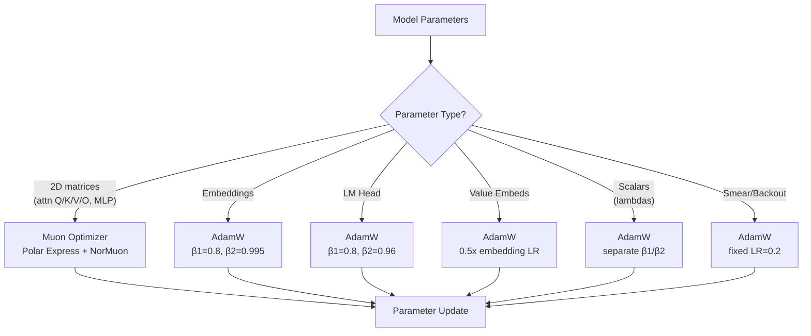

# Mixed Muon + AdamW Optimizer

## Overview

flaxchat uses a mixed optimizer matching nanochat's design: **Muon** for 2D matrix parameters (attention/MLP weights) and **AdamW** for everything else.



## Muon Algorithm

```
For each 2D matrix parameter:
  1. Nesterov momentum:
     m ← m * β + g * (1-β)
     g ← g * (1-β) + m * β

  2. Polar Express orthogonalization (5 iterations):
     X ← g / (‖g‖ * 1.01)
     for (a,b,c) in coefficients:
       if tall:  A = Xᵀ X;  X = a*X + X*(b*A + c*A²)
       if wide:  A = X Xᵀ;  X = a*X + (b*A + c*A²)*X
     g ← X

  3. NorMuon variance reduction:
     v_mean = mean(g², dim=reduction_dim)
     second_moment ← lerp(second_moment, v_mean, 1-β2)
     scale = rsqrt(second_moment) * normalize
     g ← g * scale

  4. Cautious weight decay + update:
     mask = (g * param) ≥ 0
     param -= lr * (g + wd * param * mask)
```

## LR Scaling

All learning rates scale automatically:

| Scaling | Formula | Source |
|---------|---------|--------|
| Batch size | `η ∝ √(B/B_ref)` | AdamW standard |
| Model dim | `η ∝ 1/√(d/768)` | μP-inspired |
| Weight decay | `λ ∝ √(B/B_ref) · (D_ref/D)` | T_epoch framework |

## LR Schedule

```
  LR
  ↑
  │     ┌─────────────────────┐
  │    /│                     │\
  │   / │     constant        │ \  warmdown
  │  /  │                     │  \ (cosine to final_lr_frac)
  │ /   │                     │   \
  │/    │                     │    \____
  └─────┴─────────────────────┴────────→ steps
  warmup          65%              35%
```

- **Warmup**: Linear, 40 steps
- **Constant**: Peak LR
- **Warmdown**: Cosine decay to 5% of peak over last 65% of training
